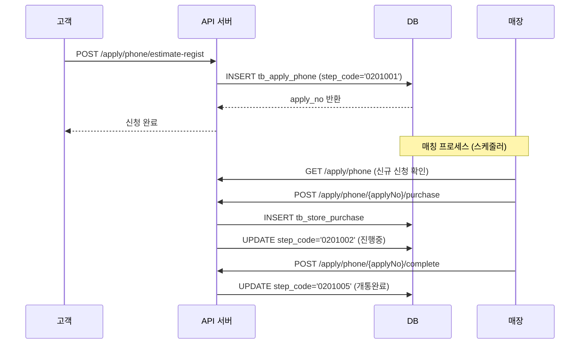

# 노피 견적신청 퍼널 분석 문서

**작성일**: 2025-11-19
**목적**: 견적신청 프로세스 전체 퍼널 분석 및 최적화 포인트 도출
**데이터 기준**: 2025-11-19

---

## 📋 목차

1. [개요](#개요)
2. [DB 테이블 구조](#db-테이블-구조)
3. [Step Code 정의](#step-code-정의)
4. [전체 퍼널 분석](#전체-퍼널-분석)
5. [API 엔드포인트](#api-엔드포인트)
6. [최적화 포인트](#최적화-포인트)

---

## 개요

노피의 견적신청 프로세스는 크게 **2가지 경로**로 나뉩니다:

1. **일반 견적 신청** (`tb_apply_phone`): 사용자가 직접 상품 선택하여 견적 신청
2. **캠페인 견적 신청** (`tb_apply_campaign_phone`): 마케팅 캠페인을 통한 간편 신청

두 경로 모두 동일한 퍼널 단계를 거치며, 최종적으로 **매장 구매 확정** → **개통 완료**로 이어집니다.

---

## DB 테이블 구조

### 핵심 테이블

| 테이블명 | 설명 | 주요 컬럼 | Row 수 (2025-11-19) |
|---------|------|----------|---------------------|
| `tb_apply_phone` | 일반 견적 신청 | apply_no, user_no, step_code, apply_product_group_code | 4,101건 |
| `tb_apply_campaign_phone` | 캠페인 견적 신청 | apply_no, user_no, step_code, apply_product_group_code | 4,772건 |
| `tb_store_purchase` | 매장 구매 확정 | purchase_no, apply_no, store_no | 3,206건 |
| `tb_user` | 사용자 정보 | user_no, created_at, deleted_yn | 5,429명 |

### 주요 컬럼 설명

#### `tb_apply_phone` / `tb_apply_campaign_phone`

- **apply_no**: 신청 번호 (PK)
- **user_no**: 신청한 사용자 번호 (FK → tb_user)
- **step_code**: 신청 진행 상태 코드 (중요!)
- **apply_product_group_code**: 신청 시 선택한 상품 그룹 코드
- **apply_product_code**: 신청 시 선택한 구체적 상품 코드
- **apply_carrier_code**: 신청 통신사 (SKT, KT, LG)
- **apply_join_type_code**: 가입 유형 (신규, 번호이동, 기기변경)
- **store_no**: 매칭된 매장 번호
- **completed_at**: 개통 완료 시각
- **created_at**: 신청 생성 시각

#### `tb_store_purchase`

- **purchase_no**: 구매 확정 번호 (PK)
- **apply_no**: 신청 번호 (FK)
- **store_no**: 매장 번호 (FK)
- **created_at**: 구매 확정 시각

---

## Step Code 정의

신청 프로세스의 각 단계는 `step_code`로 관리됩니다.

### Step Code 매핑

| Code | 상태명 | 설명 | 코드베이스 출처 |
|------|--------|------|----------------|
| `0201001` | **신청접수** | 고객이 견적 신청을 제출한 상태 | ApplyPhoneDto.java |
| `0201002` | **진행중** | 매장 DB 구매 (매칭 진행중) | ApplyPhoneDto.java |
| `0201003` | **대응완료** (매장선택) | 매장이 선택되고 고객 응대 완료 | ApplyPhoneDto.java |
| `0201004` | **개통 진행중** (방문예약) | 고객 방문 예약 완료, 개통 진행중 | ApplyPhoneDto.java |
| `0201005` | **개통완료** | 최종 개통 완료 | ApplyPhoneDto.java |
| `0201006` | **반려** (신청취소) | 매장에서 반려하거나 고객이 취소 | apply-sqlmap.xml |
| `0201007` | **취소** (매칭실패) | 매칭 실패 또는 시스템 취소 | apply-sqlmap.xml |

### Step Code 분포 (2025-11-19)

#### 일반 견적 신청 (`tb_apply_phone`) - 총 4,101건

| Step Code | 상태 | 건수 | 비율 |
|-----------|------|------|------|
| 0201006 | 반려 | 2,860건 | 69.7% |
| 0201007 | 취소 | 1,018건 | 24.8% |
| 0201003 | 대응완료 | 101건 | 2.5% |
| 0201004 | 개통 진행중 | 68건 | 1.7% |
| 0201005 | 개통완료 | 47건 | 1.1% |
| 0201001 | 신청접수 | 7건 | 0.2% |

#### 캠페인 견적 신청 (`tb_apply_campaign_phone`) - 총 4,772건

| Step Code | 상태 | 건수 | 비율 |
|-----------|------|------|------|
| 0201006 | 반려 | 3,068건 | 64.3% |
| 0201007 | 취소 | 1,094건 | 22.9% |
| 0201003 | 대응완료 | 240건 | 5.0% |
| 0201005 | 개통완료 | 193건 | 4.0% |
| 0201004 | 개통 진행중 | 168건 | 3.5% |
| 0201001 | 신청접수 | 9건 | 0.2% |

---

## 전체 퍼널 분석

### 퍼널 단계별 데이터

```
┌─────────────────────────────────────────────────────────────┐
│  1단계: 신청 (Application)                                    │
│  - 일반 견적: 4,101건                                          │
│  - 캠페인 견적: 4,772건                                        │
│  - 총 신청: 8,873건 (100.0%)                                  │
└─────────────────────────────────────────────────────────────┘
                            │
                            │ 전환율 36.13%
                            ↓
┌─────────────────────────────────────────────────────────────┐
│  2단계: 매장 구매 확정 (Store Purchase)                       │
│  - tb_store_purchase: 3,206건                                │
│  - 일반 견적 → 매장 구매: 2,610건                              │
│  - 캠페인 견적 → 매장 구매: 2,837건                            │
│  - 비율: 36.13%                                               │
└─────────────────────────────────────────────────────────────┘
                            │
                            │ 전환율 7.49%
                            ↓
┌─────────────────────────────────────────────────────────────┐
│  3단계: 개통 완료 (Completion)                                │
│  - step_code = '0201005'                                     │
│  - 일반 견적: 47건                                            │
│  - 캠페인 견적: 193건                                         │
│  - 총 개통 완료: 240건 (2.7%)                                 │
└─────────────────────────────────────────────────────────────┘
```

### 전환율 요약

| 전환 단계 | 전환율 | 비고 |
|----------|--------|------|
| **신청 → 매장 구매** | **36.13%** | 3명 중 1명이 매장 구매까지 진행 |
| **신청 → 개통 완료** | **2.70%** | 37명 중 1명만 최종 개통 |
| **매장 구매 → 개통 완료** | **7.49%** | 13명 중 1명이 개통까지 완료 |

### 이탈 분석

#### 주요 이탈 포인트

1. **반려 (0201006)**: 5,928건 (66.8%)
   - 가장 큰 이탈 원인
   - 매장에서 반려하는 케이스 + 고객 취소

2. **매칭실패 (0201007)**: 2,112건 (23.8%)
   - 두 번째 큰 이탈 원인
   - 매장 매칭 실패 또는 시스템 취소

3. **매장 구매 후 이탈**: 2,966건 (92.5% of 구매 확정)
   - 매장 구매는 했지만 개통까지 완료하지 못함
   - **가장 큰 개선 포인트**

---

## 월별 추이

### 최근 12개월 신청 추이

| 월 | 신청 건수 | 비고 |
|----|----------|------|
| 2025-11 | 217건 | 진행 중 |
| 2025-10 | 1,396건 | - |
| 2025-09 | 3,928건 | 최대 |
| 2025-08 | 2,850건 | - |
| 2025-07 | 482건 | - |

- **피크**: 2025년 9월 (3,928건)
- **최근 30일**: 407건 (일평균 13.1건)

---

## 상품별 신청 분석

### 상위 10개 인기 상품 (누적 신청 기준)

| 순위 | 상품명 | 신청 건수 |
|-----|--------|----------|
| 1 | 갤럭시 Z 폴드 7 | 1,577건 |
| 2 | 갤럭시 S25 | 901건 |
| 3 | 아이폰 16 프로 | 850건 |
| 4 | [사전예약] 아이폰 17 | 742건 |
| 5 | 갤럭시 Z 플립 7 | 717건 |
| 6 | 갤럭시 S25 울트라 | 636건 |
| 7 | [사전예약] 아이폰 17 프로 | 412건 |
| 8 | 아이폰 16 | 337건 |
| 9 | 아이폰 16 프로 맥스 | 327건 |
| 10 | 아이폰 17 | 268건 |

**인사이트**:
- 삼성 플래그십(폴드, 플립, S25) vs 애플 프리미엄(아이폰 프로) 경쟁
- 사전예약 상품도 상위권 (아이폰 17)

---

## API 엔드포인트

### 고객용 API (`api` 모듈)

#### 견적 신청 관련

| Method | Endpoint | 설명 | Controller |
|--------|----------|------|-----------|
| POST | `/apply/phone/estimate-regist` | 견적 신청 등록 | ApplyPhoneController |
| POST | `/apply/phone/estimate` | 견적 신청 목록 조회 | ApplyPhoneController |
| POST | `/apply/phone/estimate/{applyNo}` | 견적 신청 단일 조회 | ApplyPhoneController |
| POST | `/apply/phone/estimate-cancel/{applyNo}` | 견적 신청 취소 | ApplyPhoneController |
| POST | `/apply/phone/estimate-remove/{applyNo}` | 견적 신청 삭제 | ApplyPhoneController |

#### 개통 회원 정보 관련

| Method | Endpoint | 설명 | Controller |
|--------|----------|------|-----------|
| POST | `/apply/phone/estimate/user-regist` | 개통 회원 정보 등록 | ApplyPhoneController |
| POST | `/apply/phone/estimate/{applyNo}/user` | 개통 회원 정보 조회 | ApplyPhoneController |
| POST | `/apply/phone/estimate/user-id-file-regist` | 신분증 파일 등록 | ApplyPhoneController |

### 매장용 API (`agency` 모듈)

#### 신청 관리

| Method | Endpoint | 설명 | 비고 |
|--------|----------|------|------|
| GET | `/apply/phone` | 매장별 신청 목록 조회 | step_code로 필터링 가능 |
| GET | `/apply/phone/{applyNo}` | 신청 상세 조회 | - |
| POST | `/apply/phone/{applyNo}/purchase` | 매장 구매 확정 | tb_store_purchase INSERT |
| POST | `/apply/phone/{applyNo}/complete` | 개통 완료 처리 | step_code → '0201005' |
| POST | `/apply/phone/{applyNo}/reject` | 신청 반려 | step_code → '0201006' |

---

## 프로세스 플로우

### 일반 견적 신청 프로세스



### Step Code 변경 흐름

```
신청접수 (0201001)
    ↓
진행중 (0201002) ← 매장 DB 구매 (tb_store_purchase INSERT)
    ↓
대응완료 (0201003) ← 매장 응대 완료
    ↓
개통 진행중 (0201004) ← 방문 예약 완료
    ↓
개통완료 (0201005) ← 최종 개통 완료

이탈:
- 반려 (0201006) ← 매장 반려 또는 고객 취소
- 취소 (0201007) ← 매칭 실패
```

---

## 최적화 포인트

### 1. 반려율 감소 (최우선)

**현황**:
- 반려 건수: 5,928건 (전체 신청의 66.8%)
- 일반 견적: 69.7% 반려
- 캠페인 견적: 64.3% 반려

**원인 분석** (가설):
1. 매장 매칭 미스매치
2. 고객 조건 불일치 (신용, 나이 등)
3. 상품 재고 부족
4. 고객 연락 두절

**개선 방안**:
- [ ] 반려 사유 코드 추가 (DB 스키마 확장)
- [ ] 매칭 알고리즘 개선 (지역, 상품, 재고 고려)
- [ ] 고객 사전 검증 강화 (신용도, 자격 조건)
- [ ] 매장 응대율 모니터링

### 2. 매칭 실패율 감소

**현황**:
- 매칭 실패: 2,112건 (23.8%)

**개선 방안**:
- [ ] 매장 커버리지 확대 (현재 11개 → 목표 50개+)
- [ ] 상품별 매장 재고 연동
- [ ] 자동 매칭 로직 고도화

### 3. 개통 전환율 향상 (매장 구매 → 개통)

**현황**:
- 매장 구매 확정: 3,206건
- 개통 완료: 240건
- **전환율: 7.49%** ← 가장 큰 기회

**개선 방안**:
- [ ] 매장 구매 후 이탈 사유 추적
- [ ] 고객 리마인더 강화 (SMS, 알림톡)
- [ ] 매장 개통 인센티브 제공
- [ ] 개통 진행 상태 실시간 알림
- [ ] 고객 방문 예약 시스템 개선

### 4. 데이터 추적 강화

**현재 부족한 데이터**:
- 각 단계별 체류 시간
- 반려/취소 상세 사유
- 고객 연락 시도 횟수
- 매장 응대 소요 시간

**개선 방안**:
- [ ] tb_apply_phone에 step_changed_at 추가
- [ ] tb_apply_reject_reason 테이블 신규 생성
- [ ] 매장-고객 커뮤니케이션 로그 추가
- [ ] 퍼널 대시보드 구축

---

## 벤치마크 전환율

### 일반적인 O2O 플랫폼 전환율

| 단계 | 일반 전환율 | 노피 현재 | 갭 |
|------|------------|----------|-----|
| 신청 → 매칭 | 50-70% | 36.13% | -30% 미달 |
| 매칭 → 완료 | 30-50% | 7.49% | -40% 미달 |
| 전체 전환율 | 15-35% | 2.70% | -25% 미달 |

**목표 설정**:
- 단기 (3개월): 신청 → 개통 5% (현재 2.7% → 2배)
- 중기 (6개월): 신청 → 개통 10%
- 장기 (12개월): 신청 → 개통 15%

---

## 다음 단계

1. **반려 사유 데이터 수집** (최우선)
   - tb_apply_phone에 reject_reason 컬럼 추가
   - 매장 반려 시 사유 선택 필수화

2. **매장 구매 후 이탈 분석**
   - 매장 구매 후 개통하지 않은 2,966건 심층 분석
   - 고객 인터뷰 또는 설문조사

3. **퍼널 대시보드 구축**
   - 실시간 퍼널 모니터링
   - 단계별 전환율 추이 그래프
   - 이상 징후 알림

4. **A/B 테스트 설계**
   - 매칭 알고리즘 개선 효과 측정
   - 리마인더 메시지 최적화
   - 매장 인센티브 효과 검증

---

**작성자**: Data Analysis Script
**최종 업데이트**: 2025-11-19
**데이터 출처**: `/Users/jacob/Desktop/workspace/nofee/nofee_planning/nofee-data/2-processed-data/reports/application_funnel_analysis_20251119_135712.json`
